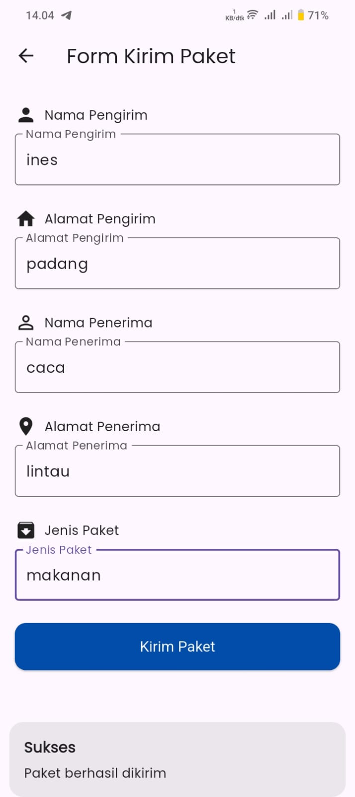

# Setangkai Ticket

A Flutter-based application designed for ticket booking. Setangkai Ticket provides a seamless and user-friendly interface for booking bus tickets and packages, viewing ticket history, managing profiles, and more.

---

## Features

- **User Authentication**: Secure login and registration.
- **Ticket Booking**: Form-based bus and package ticket booking.
- **FAQs**: Dedicated FAQ section for user queries.
- **Payment Confirmation**: Smooth and intuitive payment confirmation process.
- **History Tracking**: View past bookings in the history section.
- **Profile Management**: Easily update and manage user profiles.

---

## Screenshots

### 1. Login Page
Effortless login for users to access their accounts.


---

### 2. Register Page
Simple and secure user registration.


---

### 3. Home Page
Central hub with easy navigation to all key features.


---

### 4. FAQ Page
Get quick answers to frequently asked questions.


---

### 5. Bus Ticket Form
Convenient form to book bus tickets.


---

### 6. Package Form
Book special packages effortlessly.



---

### 7. Payment Confirmation Page
Confirm your payment with a clean and clear interface.


---

### 8. History Page
View your previous bookings in an organized manner.


---

### 9. Profile Page
Manage your profile details with ease.


---

## Installation

1. Clone the repository:
   ```bash
   git clone https://github.com/your-username/setangkai_ticket.git
